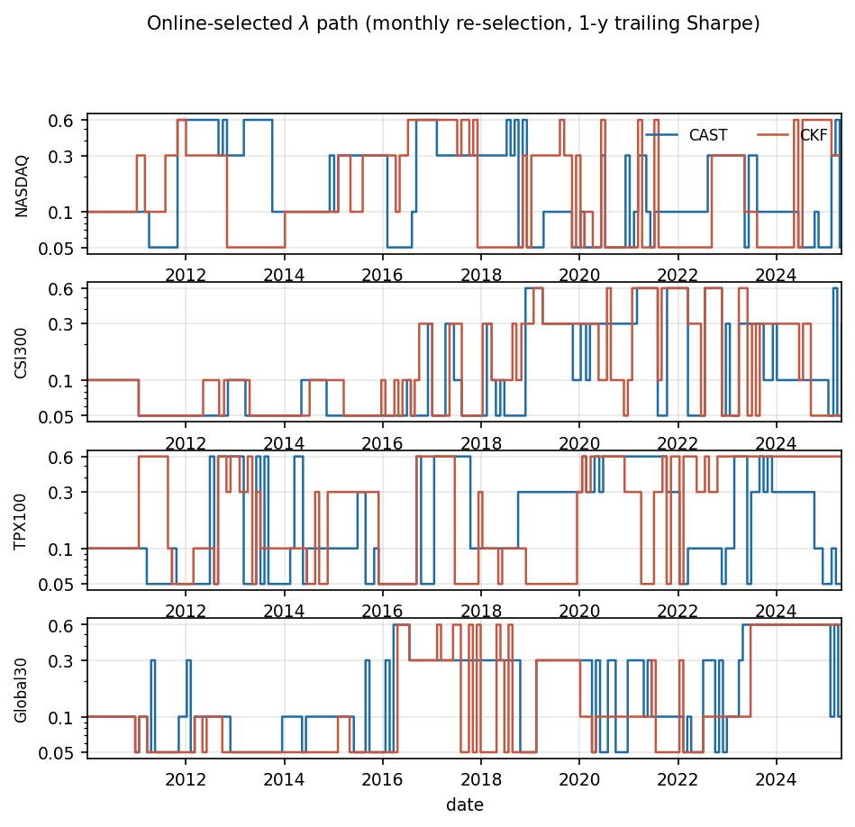
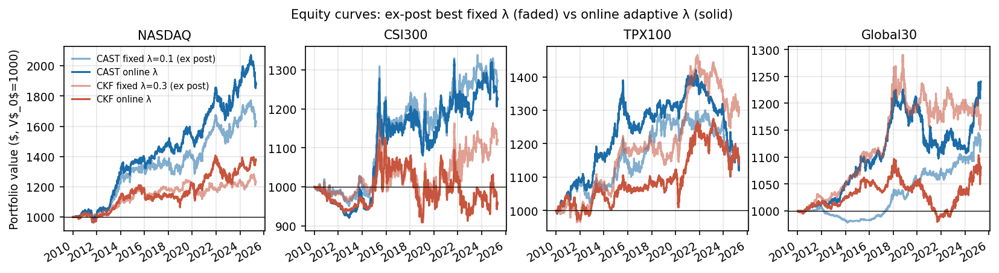

# Appendix A — Account Design & Capital Fairness

Decisions are made on one day's close and executed at the **next** day's close. 

## A.1 Thirty independent accounts, not one portfolio

Each of the `M = 30` assets in a panel is traded in its **own account**, funded
with `V_0 = $1000`, and the accounts never interact.


1. **No capital is ever transferred between assets.** An account that doubles
   does not fund an account that halves. The controller for asset `i` sees only
   `V_k^(i)`.
2. **There is no rebalancing.** Because each account is independent and never
   topped up, the method cannot earn the implicit mean-reversion premium that a
   periodically rebalanced equal-weight portfolio collects. 
3. **No FX assumption is required.** Global30 spans currencies, but since no cross-currency transfer ever occurs, the mean of 30 normalised account curves is well defined without an exchange-rate model.


## A.2 The constraint stack

Three constraints bind a position, at three levels:

| Constraint | Level | Formula | Where |
| --- | --- | --- | --- |
| Per-trade cap | transaction | `\|u_{k+l}\| · Ŝ_{k+l} ≤ β · V_k`, `β = 0.5` | inside the LP |
| No-leverage clip | position | `\|(N_k + u) · S_k\| ≤ V_k` | `_apply_no_leverage_clip` |
| Margin floor | account | liquidate and stop trading if `V_k < 0.2 · V_0` | accounting loop |


## A.3 What makes the comparison fair

Both arms run under an identical capital allocation and an identical constraint
stack by construction:

| | Shared? | How |
| --- | --- | --- |
| Starting capital | ✓ | `V_0 = $1000` × 30 accounts |
| Universe and trading days | ✓ | same panel |
| Execution timing | ✓ | same accounting loop|
| Per-trade cap, clip, margin floor | ✓ | same code path, same constants |
| `σ_v`, `σ_w` | ✓ | calibrated once, then handed to both arms |
| `σ_l` multiplier | ✓ | same MPC class |
| `λ` grid and selection protocol | ✓ | same protocol on both arms |

# Appendix B — Universe Construction

Four panels of `M = 30` daily adjusted closes, January 2005 – April 2025. Data
before `2010-01-01` is the calibration window. From `2010-01-04` onward is the
test window, on which no model parameter is fitted.


## B.0 Constituents

All 120 positions, in panel order.

- **`ρ̄ᵢ` (calib.)** — asset `i`'s mean correlation with the other 29 names in
  its panel, on **raw price first differences over the calibration window**.
- **Calib. vol** — annualised standard deviation of simple daily returns over
  the calibration window.

### NASDAQ

| # | Ticker | Company | Sector | Ccy | `ρ̄ᵢ` (calib.) | Calib. vol |
| --- | --- | --- | --- | --- | --- | --- |
| 1 | `FITB` | Fifth Third Bancorp | Financials | USD | 0.41 | 0.88 |
| 2 | `ZION` | Zions Bancorporation, National Ass… | Financials | USD | 0.42 | 0.70 |
| 3 | `HBAN` | Huntington Bancshares Incorporated | Financials | USD | 0.40 | 0.91 |
| 4 | `NTRS` | Northern Trust Corporation | Financials | USD | 0.48 | 0.46 |
| 5 | `CINF` | Cincinnati Financial Corporation | Financials | USD | 0.47 | 0.38 |
| 6 | `CBSH` | Commerce Bancshares, Inc. | Financials | USD | 0.47 | 0.34 |
| 7 | `WABC` | Westamerica Bancorporation | Financials | USD | 0.47 | 0.39 |
| 8 | `WSFS` | WSFS Financial Corporation | Financials | USD | 0.41 | 0.48 |
| 9 | `HST` | Host Hotels & Resorts, Inc. | Real Est. | USD | 0.48 | 0.65 |
| 10 | `REG` | Regency Centers Corporation | Real Est. | USD | 0.48 | 0.53 |
| 11 | `DRH` | DiamondRock Hospitality Company | Real Est. | USD | 0.44 | 0.66 |
| 12 | `INTC` | Intel Corporation | Technology | USD | 0.43 | 0.35 |
| 13 | `CSCO` | Cisco Systems, Inc. | Technology | USD | 0.44 | 0.33 |
| 14 | `MU` | Micron Technology, Inc. | Technology | USD | 0.29 | 0.60 |
| 15 | `MCHP` | Microchip Technology Incorporated | Technology | USD | 0.41 | 0.34 |
| 16 | `MRVL` | Marvell Technology, Inc. | Technology | USD | 0.26 | 0.52 |
| 17 | `AKAM` | Akamai Technologies, Inc. | Technology | USD | 0.28 | 0.55 |
| 18 | `BIIB` | Biogen Inc. | Healthcare | USD | 0.22 | 0.43 |
| 19 | `AMGN` | Amgen Inc. | Healthcare | USD | 0.27 | 0.30 |
| 20 | `GILD` | Gilead Sciences, Inc. | Healthcare | USD | 0.35 | 0.33 |
| 21 | `INCY` | Incyte Corporation | Healthcare | USD | 0.27 | 0.69 |
| 22 | `ICLR` | ICON Public Limited Company | Healthcare | USD | 0.18 | 0.41 |
| 23 | `DLTR` | Dollar Tree, Inc. | Cons. Def. | USD | 0.28 | 0.35 |
| 24 | `EXPE` | Expedia Group, Inc. | Cons. Cyc. | USD | 0.30 | 0.48 |
| 25 | `SBUX` | Starbucks Corporation | Cons. Cyc. | USD | 0.35 | 0.40 |
| 26 | `EBAY` | eBay Inc. | Cons. Cyc. | USD | 0.29 | 0.43 |
| 27 | `MAR` | Marriott International, Inc. | Cons. Cyc. | USD | 0.43 | 0.41 |
| 28 | `PCAR` | PACCAR Inc | Industrials | USD | 0.46 | 0.44 |
| 29 | `TROW` | T. Rowe Price Group, Inc. | Financials | USD | 0.51 | 0.49 |
| 30 | `FAST` | Fastenal Company | Industrials | USD | 0.44 | 0.39 |

### CSI300

| # | Ticker | Company | Sector | Ccy | `ρ̄ᵢ` (calib.) | Calib. vol |
| --- | --- | --- | --- | --- | --- | --- |
| 1 | `600006.SS` | DongFeng Automobile Co. LTD | Cons. Cyc. | CNY | 0.50 | 0.48 |
| 2 | `000060.SZ` | Shenzhen Zhongjin Lingnan Nonfemet… | Materials | CNY | 0.49 | 0.62 |
| 3 | `600266.SS` | Beijing Urban Construction Investm… | Real Est. | CNY | 0.44 | 0.59 |
| 4 | `600188.SS` | Yankuang Energy Group Company Limi… | Energy | CNY | 0.48 | 0.55 |
| 5 | `600019.SS` | Baoshan Iron & Steel Co., Ltd. | Materials | CNY | 0.46 | 0.45 |
| 6 | `600831.SS` | Shaanxi Broadcast & TV Network Int… | Comm. Svcs | CNY | 0.44 | 0.55 |
| 7 | `600597.SS` | Bright Dairy & Food Co.,Ltd | Cons. Def. | CNY | 0.45 | 0.55 |
| 8 | `600572.SS` | Zhejiang CONBA Pharmaceutical Co.,… | Healthcare | CNY | 0.43 | 0.53 |
| 9 | `600050.SS` | China United Network Communication… | Comm. Svcs | CNY | 0.44 | 0.44 |
| 10 | `600754.SS` | Shanghai Jin Jiang International H… | Cons. Cyc. | CNY | 0.43 | 0.49 |
| 11 | `600016.SS` | China Minsheng Banking Corp., Ltd. | Financials | CNY | 0.44 | 0.45 |
| 12 | `600085.SS` | Beijing Tongrentang Co., Ltd | Healthcare | CNY | 0.44 | 0.44 |
| 13 | `000166.SZ` | Shenwan Hongyuan Group Co., Ltd. | Financials | CNY | 0.46 | 0.63 |
| 14 | `600059.SS` | Zhejiang Guyuelongshan Shaoxing Wi… | Cons. Def. | CNY | 0.45 | 0.53 |
| 15 | `600518.SS` | Kangmei Pharmaceutical Co., Ltd. | Healthcare | CNY | 0.41 | 0.49 |
| 16 | `600015.SS` | Hua Xia Bank Co., Limited | Financials | CNY | 0.40 | 0.49 |
| 17 | `600739.SS` | Liaoning Cheng Da Co., Ltd. | Healthcare | CNY | 0.44 | 0.65 |
| 18 | `000002.SZ` | China Vanke Co., Ltd. | Real Est. | CNY | 0.40 | 0.52 |
| 19 | `600362.SS` | Jiangxi Copper Company Limited | Materials | CNY | 0.41 | 0.68 |
| 20 | `601600.SS` | Aluminum Corporation of China Limi… | Materials | CNY | 0.37 | 0.57 |
| 21 | `600886.SS` | SDIC Power Holdings Co., Ltd | Utilities | CNY | 0.43 | 0.47 |
| 22 | `600028.SS` | China Petroleum & Chemical Corpora… | Energy | CNY | 0.40 | 0.47 |
| 23 | `600795.SS` | GD Power Development Co.,Ltd | Utilities | CNY | 0.45 | 0.49 |
| 24 | `000877.SZ` | Tianshan Material Co., Ltd. | Materials | CNY | 0.42 | 0.55 |
| 25 | `000789.SZ` | Jiangxi Wannianqing Cement Co., Lt… | Materials | CNY | 0.41 | 0.58 |
| 26 | `000983.SZ` | Shanxi Coking Coal Energy Group Co… | Energy | CNY | 0.40 | 0.62 |
| 27 | `600061.SS` | SDIC Capital Co.,Ltd | Financials | CNY | 0.42 | 0.61 |
| 28 | `600637.SS` | Oriental Pearl Group Co.,Ltd. | Comm. Svcs | CNY | 0.33 | 0.56 |
| 29 | `600688.SS` | Sinopec Shanghai Petrochemical Com… | Energy | CNY | 0.37 | 0.42 |
| 30 | `600009.SS` | Shanghai International Airport Co.… | Industrials | CNY | 0.41 | 0.46 |

### TPX100

| # | Ticker | Company | Sector | Ccy | `ρ̄ᵢ` (calib.) | Calib. vol |
| --- | --- | --- | --- | --- | --- | --- |
| 1 | `7203.T` | Toyota Motor Corporation | Cons. Cyc. | JPY | 0.50 | 0.34 |
| 2 | `7267.T` | Honda Motor Co., Ltd. | Cons. Cyc. | JPY | 0.46 | 0.41 |
| 3 | `7269.T` | Suzuki Motor Corporation | Cons. Cyc. | JPY | 0.43 | 0.39 |
| 4 | `6758.T` | Sony Group Corporation | Technology | JPY | 0.45 | 0.41 |
| 5 | `6861.T` | Keyence Corporation | Technology | JPY | 0.32 | 0.43 |
| 6 | `6981.T` | Murata Manufacturing Co., Ltd. | Technology | JPY | 0.39 | 0.38 |
| 7 | `6501.T` | Hitachi, Ltd. | Industrials | JPY | 0.43 | 0.35 |
| 8 | `8035.T` | Tokyo Electron Limited | Technology | JPY | 0.42 | 0.44 |
| 9 | `6857.T` | Advantest Corporation | Technology | JPY | 0.35 | 0.46 |
| 10 | `7974.T` | Nintendo Co., Ltd. | Comm. Svcs | JPY | 0.35 | 0.43 |
| 11 | `9684.T` | Square Enix Holdings Co., Ltd. | Comm. Svcs | JPY | 0.28 | 0.37 |
| 12 | `8001.T` | ITOCHU Corporation | Industrials | JPY | 0.43 | 0.45 |
| 13 | `8058.T` | Mitsubishi Corporation | Industrials | JPY | 0.44 | 0.45 |
| 14 | `8031.T` | Mitsui & Co., Ltd. | Industrials | JPY | 0.41 | 0.46 |
| 15 | `8306.T` | Mitsubishi UFJ Financial Group, In… | Financials | JPY | 0.43 | 0.41 |
| 16 | `8316.T` | Sumitomo Mitsui Financial Group, I… | Financials | JPY | 0.41 | 0.48 |
| 17 | `4543.T` | Terumo Corporation | Healthcare | JPY | 0.36 | 0.34 |
| 18 | `9432.T` | NTT, Inc. | Comm. Svcs | JPY | 0.29 | 0.29 |
| 19 | `9433.T` | KDDI Corporation | Comm. Svcs | JPY | 0.29 | 0.33 |
| 20 | `9984.T` | SoftBank Group Corp. | Comm. Svcs | JPY | 0.29 | 0.52 |
| 21 | `4502.T` | Takeda Pharmaceutical Company Limi… | Healthcare | JPY | 0.39 | 0.28 |
| 22 | `4519.T` | Chugai Pharmaceutical Co., Ltd. | Healthcare | JPY | 0.22 | 0.34 |
| 23 | `4503.T` | Astellas Pharma Inc. | Healthcare | JPY | 0.38 | 0.31 |
| 24 | `6301.T` | Komatsu Ltd. | Industrials | JPY | 0.44 | 0.47 |
| 25 | `7011.T` | Mitsubishi Heavy Industries, Ltd. | Industrials | JPY | 0.43 | 0.40 |
| 26 | `4063.T` | Shin-Etsu Chemical Co., Ltd. | Materials | JPY | 0.45 | 0.37 |
| 27 | `6367.T` | Daikin Industries,Ltd. | Industrials | JPY | 0.43 | 0.45 |
| 28 | `4452.T` | Kao Corporation | Cons. Def. | JPY | 0.28 | 0.27 |
| 29 | `9983.T` | Fast Retailing Co., Ltd. | Cons. Cyc. | JPY | 0.27 | 0.44 |
| 30 | `9020.T` | East Japan Railway Company | Industrials | JPY | 0.28 | 0.26 |

### Global30

| # | Ticker | Company | Sector | Ccy | `ρ̄ᵢ` (calib.) | Calib. vol |
| --- | --- | --- | --- | --- | --- | --- |
| 1 | `F` | Ford Motor Company | Cons. Cyc. | USD | 0.17 | 0.59 |
| 2 | `KO` | The Coca-Cola Company | Cons. Def. | USD | 0.15 | 0.21 |
| 3 | `JPM` | JPMorgan Chase & Co. | Financials | USD | 0.17 | 0.54 |
| 4 | `WMT` | Walmart Inc. | Cons. Def. | USD | 0.14 | 0.22 |
| 5 | `NVDA` | NVIDIA Corporation | Technology | USD | 0.15 | 0.56 |
| 6 | `AAPL` | Apple Inc. | Technology | USD | 0.17 | 0.42 |
| 7 | `VOW3.DE` | Volkswagen AG | Cons. Cyc. | EUR | 0.16 | 0.44 |
| 8 | `BMW.DE` | Bayerische Motoren Werke Aktienges… | Cons. Cyc. | EUR | 0.27 | 0.35 |
| 9 | `SAP.DE` | SAP SE | Technology | EUR | 0.23 | 0.28 |
| 10 | `SIE.DE` | Siemens Aktiengesellschaft | Industrials | EUR | 0.29 | 0.37 |
| 11 | `ASML.AS` | ASML Holding N.V. | Technology | EUR | 0.23 | 0.35 |
| 12 | `NOVO-B.CO` | Novo Nordisk A/S | Healthcare | DKK | 0.03 | 1.50 |
| 13 | `9684.T` | Square Enix Holdings Co., Ltd. | Comm. Svcs | JPY | 0.15 | 0.36 |
| 14 | `7733.T` | Olympus Corporation | Healthcare | JPY | 0.22 | 0.43 |
| 15 | `7203.T` | Toyota Motor Corporation | Cons. Cyc. | JPY | 0.23 | 0.33 |
| 16 | `6758.T` | Sony Group Corporation | Technology | JPY | 0.21 | 0.41 |
| 17 | `6857.T` | Advantest Corporation | Technology | JPY | 0.19 | 0.45 |
| 18 | `8035.T` | Tokyo Electron Limited | Technology | JPY | 0.23 | 0.43 |
| 19 | `LLOY.L` | Lloyds Banking Group plc | Financials | GBp | 0.24 | 0.67 |
| 20 | `BARC.L` | Barclays PLC | Financials | GBp | 0.27 | 0.66 |
| 21 | `ULVR.L` | Unilever PLC | Cons. Def. | GBp | 0.18 | 0.25 |
| 22 | `RIO.L` | Rio Tinto Group | Materials | GBp | 0.25 | 0.56 |
| 23 | `AZN.L` | AstraZeneca PLC | Healthcare | GBp | 0.17 | 0.26 |
| 24 | `SHEL.L` | Shell plc | Energy | GBp | 0.23 | 0.28 |
| 25 | `0001.HK` | CK Hutchison Holdings Limited | Industrials | HKD | 0.25 | 0.36 |
| 26 | `0939.HK` | China Construction Bank Corporation | Financials | HKD | 0.26 | 0.42 |
| 27 | `0941.HK` | China Mobile Limited | Comm. Svcs | HKD | 0.27 | 0.37 |
| 28 | `2318.HK` | Ping An Insurance (Group) Company … | Financials | HKD | 0.24 | 0.50 |
| 29 | `0700.HK` | Tencent Holdings Limited | Comm. Svcs | HKD | 0.18 | 0.52 |
| 30 | `600519.SS` | Kweichow Moutai Co., Ltd. | Cons. Def. | CNY | 0.09 | 0.39 |


## B.1 Why four panels, and how each was built

These four panels are designed to comprehensively examine the following factors: cross-asset coupling strength and the heterogeneity of constituent stocks.

| Panel | Regime it represents | `ρ̄` | Selection rule |
| --- | --- | --- | --- |
| NASDAQ | Moderate coupling, sector-diverse | 0.38 | Six sectors (banks, REITs, mature tech, biotech, consumer, industrials), 3–8 names each |
| CSI300 | High coupling | 0.43 | Screen the CSI300 universe, compute pairwise `ρ` on 2005–2010 only, take the top 30 by mean calibration `ρ` |
| TPX100 |Moderate coupling | 0.38 | 30 TSE large-caps hand-selected across ten sectors |
| Global30 | Low coupling, high heterogeneity| 0.20 | 5 currency zones × 3 growth modes (non-growth, slow, explosive) × 2 sector-diverse names |

**Why this particular set.** The design is a 2 × 2 that isolates the two
variables the method's theory depends on:

|  | Homogeneous constituents | Heterogeneous constituents |
| --- | --- | --- |
| **High `ρ̄`** | CSI300 (0.43) | — |
| **Moderate `ρ̄`** | TPX100 (0.38) | NASDAQ (0.38) |
| **Low `ρ̄`** | — | Global30 (0.20) |

This setup ensures that the dataset covers a range of correlations from high to low, and also proves that the model's performance does not monotonously track `ρ̄`.

### B.2 The candidate-pool screens

Both screens make the test harder.

1. **Weak Signal Priority.** We selected stocks with weak trading signals for testing. This served two purposes: firstly, to assess their performance in controlling drawdowns during difficult market periods, and secondly, to eliminate some stocks with strong trends and no significant drawdowns. Filtering out these stocks eliminates this free boost to returns. Therefore, the remaining drawdown performance must rely on market timing.

2. **No terminal collapse.** Every name has an unbroken daily series across the
   twenty years. The reason is mechanical: the simulator fills each order at the
   next close, and a suspension has no close to fill at, a delisting simply ends
   the series, and a short may not be borrowable. Requiring continuity keeps
   every reported number inside what the backtest can actually model, and lets
   both methods see identical observations on identical days. 

## B.3 Normalisation

Global30 spans five currencies, so each of its series is divided by its first-day price; the other three panels use raw prices. The division is applied to the whole series, calibration window included, so it introduces no information asymmetry. Its only effect is to put the 30 series on a
comparable numerical scale so that a single `σ_l` multiplier and a single per-trade cap mean the same thing across currencies.

# Appendix C — Complete Parameter Listing

## C.0 Consolidated table

The experiment splits the data **in two**, at 2010-01-01:

| Label | Span | Used for |
| --- | --- | --- |
| `CAL` | 2005-01-03 → 2009-12-31 | `σ_v`, `σ_w`, `ρ` fitted here, then frozen |
| `TEST` | 2010-01-04 → 2025-04-30 | reporting only |

| # | Parameter | Value | What it does |
| --- | --- | --- | --- |
| 1 | Forecast / MPC horizon `L` | 7 trading days | length of the forecast path and of the MPC plan |
| 2 | IRW model orders `r` | {1, 2, 3} | the three structural hypotheses (level / trend / curvature) |
| 3 | Per-trade cap `β` | 0.5 · `V_k` | no transaction exceeds half the account |
| 4 | Initial capital `V_0` | $1000 per asset | 30 independent accounts |
| 5 | Risk aversion `λ` | grid {0.05, 0.1, 0.3, 0.6} | trades expected profit against forecast uncertainty; the selection protocol is covered in the main text |
| 6 | `σ_v`, `σ_w` | per asset, grid-searched on 1-step RMSE over `CAL`; the order-1 pair is reused for all three orders | process / observation noise of each IRW filter |
| 7 | `ρ` | 30 × 30 per panel, from `CAL`; Pearson correlation of **raw price first differences**, symmetrised, diagonal 1, NaN → 0 | the only place assets are coupled — off-diagonals of `Q̃` |
| 8 | Credibility weight | `log η = −0.5 · L · log(score)`, normalised | turns realised L-step error into a model weight |
| 9 | Risk-weight multiplier `c` | 1.5 | scales the MPC risk penalty; enters only as `λ·c`, so it rescales the λ grid |
| 10 | Margin floor | liquidate when `V_k < 0.2 · V_0` | account-level stop, standing in for a margin call |
| 11 | Annualisation | 252 trading days | Sharpe, Sortino, Calmar, annualised return |
| 12 | Missing-value handling | `ffill().bfill().dropna(how="any")` | data hygiene — a verified no-op; all four panels contain zero missing values |
| 13 | Price normalisation | Global30 only: divide by first-day price | removes the cross-currency level mismatch |

## C.1 The risk-weight multiplier `c`

`c = 1.5` is introduced here. The function describes how forecast uncertainty grows with the look-ahead step, and carries no scale of its own. A multiplier is what sets the strength of that penalty against the profit term, and `c` supplies it.

`c` can only make the controller **more conservative**: it enlarges the penalty on position size and cannot enlarge the predicted price gradient that drives the position, so it cannot manufacture a directional edge.

### Ablation over `c`

**Setup.** All four panels × both methods × `c` ∈ {1.0, 1.5, 2.0} × the
four-point λ grid = 96 configurations, scored on the test window. Capital, constraints,
calibration and accounting are shared.

| `c` | Effective `λc` | CAST Sharpe | CAST MaxDD | CKF Sharpe | CKF MaxDD | CAST ahead | Mean gap | NASDAQ | CSI300 | TPX100 | Global30 |
| --- | --- | --- | --- | --- | --- | --- | --- | --- | --- | --- | --- |
| 1.0 | 0.05 – 0.60 | 0.232 | 0.125 | 0.148 | 0.150 | **11 / 16** | **+0.084** | 4/4 | 2/4 | 1/4 | 4/4 |
| **1.5** (used) | 0.075 – 0.90 | **0.256** | 0.108 | **0.184** | 0.124 | 10 / 16 | +0.072 | 4/4 | 2/4 | 1/4 | 3/4 |
| 2.0 | 0.10 – 1.20 | 0.169 | **0.104** | 0.146 | **0.122** | 7 / 16 | +0.023 | 3/4 | 1/4 | 1/4 | 2/4 |

Sharpe and MaxDD are means over the 16 (panel × λ) cells.The last four columns
give, per panel, the number of λ settings on which CAST leads.

**Choice.** `c` = 1.5 is taken on combined Sharpe and drawdown. 

## C.2 Margin floor — ablated, not tuned

The floor binds on **16 of 480** CKF accounts and **17 of 480** CAST
accounts. Re-running all 32 configurations without it:

| | with floor | without floor |
| --- | --- | --- |
| CAST ahead in | 10 / 16 | 10 / 16 |
| Mean Sharpe gap (CAST − baseline) | +0.0718 | +0.0686 |

The ordering is unchanged, and **14 of the 32 configurations are bit-identical** either way in those the floor never fires at all. It is a safety rail, not a source of the result.

# Appendix D — An Adaptive Risk Weight

## D.1 What changes

In the main results, the risk weight "λ" is a fixed value. To verify the flexibility of our model in different markets, we added some experiments by redesigning the risk weights "λ" to be updated online.

Here the weight is allowed to move:

```
λ · Σ_l |u_{k+l}| σ_l        →        λ_k · Σ_l |u_{k+l}| σ_l
```

The other settings of the experiment are consistent with those of the main experiment.

## D.2 How `λ_k` is chosen

Every 21 trading days, the real account switches to the account with the highest Sharpe ratio among the four accounts over the past 252 days. Before these 252 days, it uses `λ = 0.1`. The tracking window is `[k-252, k)`, thus only referencing events that have already occurred.

## D.3 Results

Annualised Sharpe on the test window. The **fixed** columns reproduce Table I exactly, so the two settings are directly comparable.

| Panel | CAST fixed | CAST adaptive | CKF fixed | CKF adaptive |
| --- | --- | --- | --- | --- |
| NASDAQ | 0.523 | **0.717** | 0.339 | **0.392** |
| CSI300 | 0.269 | 0.248 | 0.138 | −0.007 |
| TPX100 | 0.228 | 0.227 | 0.384 | 0.222 |
| Global30 | 0.516 | 0.483 | 0.331 | 0.237 |

CAST minus CKF:

| Panel | fixed | adaptive |
| --- | --- | --- |
| NASDAQ | +0.184 | +0.325 |
| CSI300 | +0.131 | +0.255 |
| TPX100 | −0.156 | +0.005 |
| Global30 | +0.186 | +0.246 |
| Panels led | 3 / 4 | 4 wins |

The lead widens on the three panels CAST already led, and TPX100 moves from a clear loss to a tie. Both methods face the same rule.

Maximum drawdown over the same window (lower is better, the fixed columns again match Table I exactly):

| Panel | CAST fixed | CAST adaptive | CKF fixed | CKF adaptive |
| --- | --- | --- | --- | --- |
| NASDAQ | 0.114 | 0.117 | 0.103 | 0.135 |
| CSI300 | 0.158 | 0.155 | 0.218 | 0.193 |
| TPX100 | 0.134 | 0.212 | 0.150 | 0.136 |
| Global30 | 0.031 | 0.105 | 0.107 | 0.107 |

CAST has the lower drawdown than CKF on three of four panels under either setting. For CAST, it rises on three panels, most of all on Global30, from 0.031 to 0.105. The adaptive weight therefore buys Sharpe at some expense of drawdown, and the two tables should be read together.

### D.3.1 Comparison

The Risk Weight update frequency mentioned above is monthly. We also conducted experiments with weekly and quarterly update frequencies for comparison. This highlights the flexibility of our model in adapting to different markets.

| Panel | Method | Sharpe wk | Sharpe mo | Sharpe qt | MaxDD wk | MaxDD mo | MaxDD qt |
| --- | --- | --- | --- | --- | --- | --- | --- |
| NASDAQ | CAST | 0.604 | 0.717 | 0.728 | 0.104 | 0.117 | 0.148 |
| NASDAQ | CKF | 0.289 | 0.392 | 0.446 | 0.143 | 0.135 | 0.144 |
| CSI300 | CAST | 0.117 | 0.248 | 0.099 | 0.153 | 0.155 | 0.188 |
| CSI300 | CKF | −0.090 | −0.007 | −0.006 | 0.265 | 0.193 | 0.203 |
| TPX100 | CAST | 0.150 | 0.227 | 0.255 | 0.193 | 0.212 | 0.192 |
| TPX100 | CKF | 0.170 | 0.222 | 0.238 | 0.176 | 0.136 | 0.193 |
| Global30 | CAST | 0.563 | 0.483 | 0.460 | 0.135 | 0.105 | 0.150 |
| Global30 | CKF | 0.368 | 0.237 | 0.213 | 0.169 | 0.107 | 0.118 |


## D.4 Figures


- **`fig_lambda_path.png`** — the weight actually chosen each month. It moves
  across the whole grid, and the two methods often disagree.


- **`fig_equity.png`** — equity curves, fixed (faded) against adaptive (solid).


