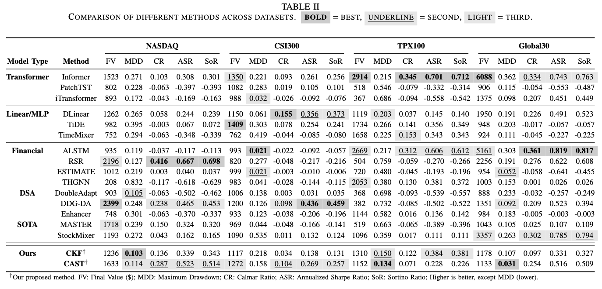

# CAST: A Cross-Asset State-Space Trading System

Code and data for reproducing the main results of CAST.

---

## Repository Layout

```
CAST/
├── data/raw/
│   ├── NASDAQ.{parquet,json}
│   ├── CSI300.{parquet,json}
│   ├── TPX100.{parquet,json}
│   └── Global30.{parquet,json}
├── src/
│   ├── metrics.py
│   ├── mpc.py
│   ├── backtest.py
│   └── filter/
│       ├── single_ckf.py
│       └── cokf.py
└── experiments/
    └── m30_main_results.py
```

---
## Datasets

Four panels of 30 daily-close stocks, January 2005 to April 2025:

| Dataset  | Description                |
|----------|----------------------------|
| NASDAQ   | U.S. large-cap             |
| CSI300   | Chinese A-share large-cap  |
| TPX100   | Japanese blue-chips        |
| Global30 | Cross-currency basket      |

Each panel is one `.parquet` (prices) + one `.json` (tickers). 

Global30 prices (different currencies) are normalized to the first-day value before backtesting, while the other three datasets use raw prices.

---

## Overall Comparison



---

## Setup

```bash
pip install -r requirements.txt
```

Requires Python ≥ 3.10. CPU only — no GPU/CUDA needed. A full run takes ~40 minutes.

---

## Reproducing the Main Results

```bash
python3 -u experiments/m30_main_results.py
```

Settings (paper-locked):

| Parameter             | Value                              |
|-----------------------|------------------------------------|
| Calibration window    | data before 2010-01-01 (~5 years)  |
| Test window           | data from 2010-01-01 (~15 years)   |
| MPC horizon $L$       | 7                                  |
| Per-trade cap $\beta$ | 0.5                                |
| Initial capital       | \$1000                             |
| $\lambda$ grid        | {0.05, 0.1, 0.3, 0.6}              |
| IRW orders            | (1, 2, 3)                          |

Two CSVs are written to data/:

>m30_main_results.csv — one per (dataset, $\lambda$, method).

>m30_main_results_best_lambda.csv — best $\lambda$ per (dataset, method). Matches Table I of the paper.

---
