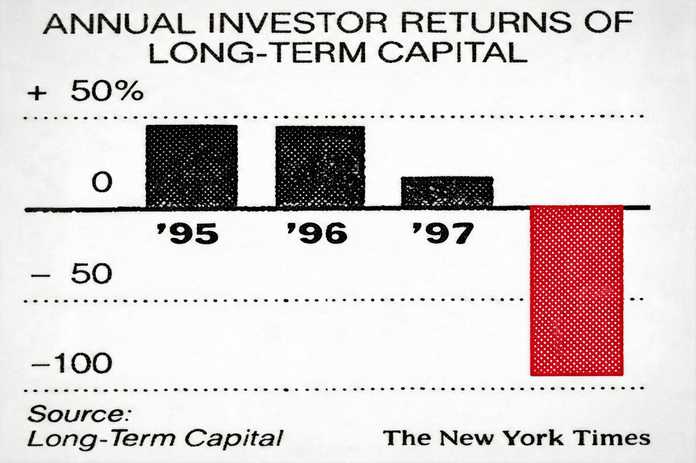
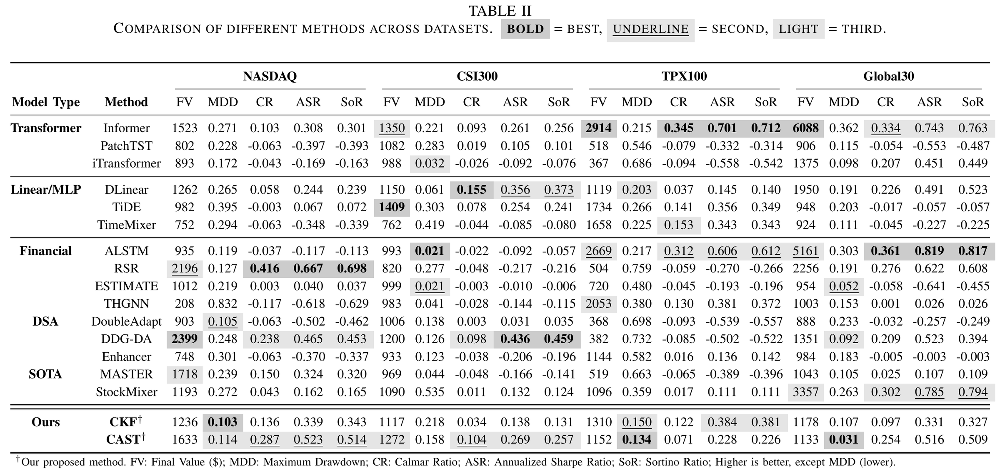

# [CAST](https://fanbrowell.github.io/CAST/): A Cross-Asset State-Space Trading System for Drawdown Control in Stock Markets

<p align="left">
  <a href="https://arxiv.org/abs/2609.14205"></a>
  <a href="https://arxiv.org/pdf/2609.14205"></a>
  <a href="https://fanbrowell.github.io/CAST/"></a>
  <a href="https://huggingface.co/datasets/CharlieYPeng/CAST-stock-panels"></a>
  <a href="https://icdm2026.neu.edu.cn/"></a>
  <a href="#citation"></a>
  <a href="./LICENSE"></a>
  
  
  <a href="https://github.com/FanBroWell/CAST/stargazers"></a>
</p>

<table>
  <tr>
    <td width="32%"></td>
    <td>
      <a href="https://arxiv.org/abs/2609.14205"><b>A Cross-Asset State-Space Trading System for Drawdown Control in Stock Markets</b></a><br>
      Accepted at <a href="https://icdm2026.neu.edu.cn/">IEEE ICDM 2026</a><br>
      <a href="https://ypeng.online/">Yu Peng</a><sup>1</sup>,
      <a href="https://www.brunel.ac.uk/people/matloob-khushi">Matloob Khushi</a><sup>2</sup>,
      <a href="https://www.sydney.edu.au/engineering/about/our-people/academic-staff/josiah-poon.html">Josiah Poon</a><sup>1</sup><br>
      <sup>1</sup> The University of Sydney &nbsp;&nbsp; <sup>2</sup> Brunel University London<br>
      <a href="https://arxiv.org/abs/2609.14205">arXiv:2609.14205</a> &nbsp;|&nbsp;
      <a href="https://arxiv.org/pdf/2609.14205">PDF</a> &nbsp;|&nbsp;
      <a href="https://fanbrowell.github.io/CAST/">Project Page</a>
    </td>
  </tr>
</table>

<details>
<summary>Click here to read the <b>abstract 📝</b></summary>
<br>

Managing drawdown, the peak-to-trough decline in an investment portfolio's value, is a precondition for long-term survival in practical investment management. However, mainstream stock forecasting methods predominantly optimize returns or Sharpe ratios under the independent and identically distributed (i.i.d.) assumption. Real markets do not follow this assumption, triggering catastrophic drawdowns. We propose a cross-asset state-space trading system (CAST), consisting of two components: The predictor, Cross-Asset Collaborative Kalman Filter (CoKF), estimates each asset's latent state online, coupling all assets through their correlations and adaptively fusing multiple integrated-random-walk orders. The controller, Model Predictive Control (MPC), converts the predictor's forecast into trades, using forecast uncertainty as an explicit risk penalty that controls drawdown. We evaluate CAST on four real-world stock markets over a 15-year test window and show that it consistently occupies the return&ndash;drawdown Pareto frontier, achieving strong risk-adjusted performance while maintaining substantially lower maximum drawdown than competitive baselines. A stress test across crisis periods further demonstrates robust behavior under market shocks and distribution shift. Because the predictor and controller interact only through the predicted price path, both are plug-and-play, making CAST a modular, interpretable trading system.
</details>

---

🔗 **Contents**
1. [Repository Layout](#repository-layout)
1. [Overall Comparison](#overall-comparison)
1. [Datasets](#datasets)
1. [Setup](#setup)
1. [Reproducing the Main Results](#reproducing-the-main-results)
1. [Citation](#citation)

---

## Repository Layout

```
CAST/
├── data/raw/
│   ├── NASDAQ.{parquet,json}
│   ├── CSI300.{parquet,json}
│   ├── TPX100.{parquet,json}
│   └── Global30.{parquet,json}
├── src/
│   ├── metrics.py
│   ├── mpc.py
│   ├── backtest.py
│   └── filter/
│       ├── single_ckf.py
│       └── cokf.py
└── experiments/
    └── m30_main_results.py
```

## Overall Comparison

<p align="center">
  
</p>

---
## Datasets

Four panels of 30 daily-close stocks, January 2005 to April 2025:

| Dataset  | Description                |
|----------|----------------------------|
| NASDAQ   | U.S. large-cap             |
| CSI300   | Chinese A-share large-cap  |
| TPX100   | Japanese blue-chips        |
| Global30 | Cross-currency basket      |

Each panel is one `.parquet` (prices) + one `.json` (tickers). 

The same panels are on Hugging Face as [CharlieYPeng/CAST-stock-panels](https://huggingface.co/datasets/CharlieYPeng/CAST-stock-panels):

```python
from datasets import load_dataset
ds = load_dataset("CharlieYPeng/CAST-stock-panels", "NASDAQ", split="train")  # or CSI300, TPX100, Global30
```

Global30 prices (different currencies) are normalized to the first-day value before backtesting, while the other three datasets use raw prices.

---

## Setup

```bash
pip install -r requirements.txt
```

Requires Python ≥ 3.10. CPU only — no GPU/CUDA needed. A full run takes ~40 minutes.

---

## Reproducing the Main Results

```bash
python3 -u experiments/m30_main_results.py
```

Settings:

| Parameter             | Value                              |
|-----------------------|------------------------------------|
| Calibration window    | data before 2010-01-01 (~5 years)  |
| Test window           | data from 2010-01-01 (~15 years)   |
| MPC horizon $L$       | 7                                  |
| Per-trade cap $\beta$ | 0.5                                |
| Initial capital       | \$1000                             |
| $\lambda$ grid        | {0.05, 0.1, 0.3, 0.6}              |
| IRW orders            | (1, 2, 3)                          |

Backtest timing and calibration:

- Decisions are made after observing the current close and are executed at the next close.
- $\rho$ and the Kalman noise parameters ($\sigma_v$, $\sigma_w$) are calibrated only from pre-2010 data and kept fixed during the 2010-2025 test window.
- During testing, Kalman states and model-order weights are updated online using only information available up to the current day.

Running `experiments/m30_main_results.py` generates the following CSV files under `data/`:

- `m30_main_results.csv`: full sweep over the reported MPC risk weights, one row per `(dataset, lambda, method)`.
- `m30_main_results_best_lambda.csv`: post-hoc summary of the best-Sharpe operating point within the reported lambda grid. This file is provided only for inspecting the Fig. 6 lambda sensitivity analysis, not as a validation-selected evaluation protocol.


---

## Citation

If you find this repository or paper useful, please cite our work.

### BibTeX

    @misc{peng2026cast,
      title = {{CAST}: A Cross-Asset State-Space Trading System for Drawdown Control in Stock Markets},
      author = {Peng, Yu and Khushi, Matloob and Poon, Josiah},
      year = {2026},
      eprint = {2609.14205},
      archivePrefix = {arXiv},
      primaryClass = {cs.CE},
      doi = {10.48550/arXiv.2609.14205},
      url = {https://arxiv.org/abs/2609.14205},
      note = {Accepted at IEEE International Conference on Data Mining (ICDM 2026)}
    }

### APA

    `Peng, Y., Khushi, M., & Poon, J. (2026). CAST: A Cross-Asset State-Space Trading System for Drawdown Control in Stock Markets. arXiv. https://doi.org/10.48550/arXiv.2609.14205
    `

### IEEE

    `Y. Peng, M. Khushi, and J. Poon, "CAST: A Cross-Asset State-Space Trading System for Drawdown Control in Stock Markets," arXiv:2609.14205, 2026. doi: 10.48550/arXiv.2609.14205.
    `

### Plain Text

    `Yu Peng, Matloob Khushi, and Josiah Poon. CAST: A Cross-Asset State-Space Trading System for Drawdown Control in Stock Markets. arXiv:2609.14205, 2026. https://arxiv.org/abs/2609.14205
    `
